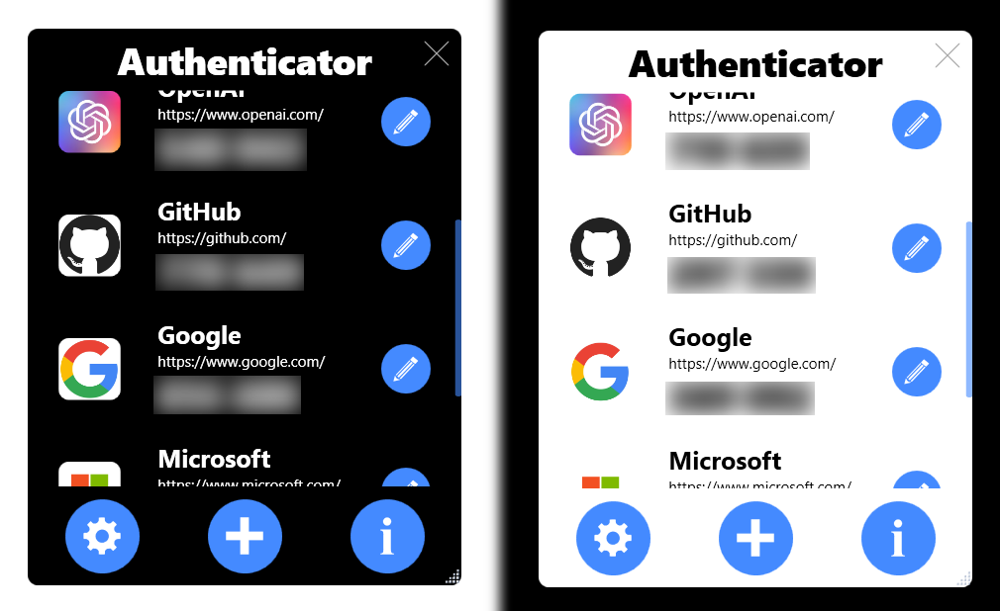

# 🔐 Authenticator: Your Reliable 2FA Companion

Welcome to Authenticator, the reliable open-source application for generating Time-based One-Time Passwords (TOTP) for your two-factor authentication (2FA) needs.

## 🔍 Features

- ⏳ **2FA Token Generation**: Secure your accounts with one-time passwords that change every 30 seconds.
- 🌙 **Light/Dark Mode**: Choose your preferred theme for the best user experience.
- 🔒 **Encryption Options**: Keep your data safe with multiple encryption methods.

## 🚀 Usage Modes

Authenticator can be used in two modes:

1. **Portable Mode**: Carry Authenticator with you on a USB drive or any portable storage. No installation required!
2. **Installed Mode**: Install Authenticator on your system for seamless access.

## 🏳️ Getting Started

1. Visit the [Releases](https://github.com/finn-freitag/Authenticator/releases) section.
2. Download the latest release.
3. Run the `Authenticator.exe` file.

## 📸 Image

## 📜 Disclaimer

While we strive for excellence, we make no guarantees regarding the accuracy, adequacy, validity, reliability, availability, or completeness of this software. We encourage users to report any issues they encounter.

## 📄 License

Authenticator is released under the MIT License. See the [LICENSE file](./LICENSE) for more details.

## 📬 Connect With Us

Have questions or suggestions? Please open an issue or pull request, and we'll get back to you.

Thank you for choosing Authenticator for your 2FA needs!